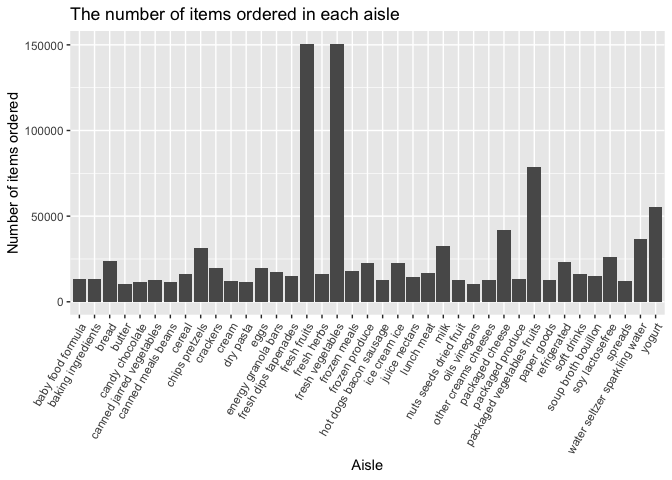
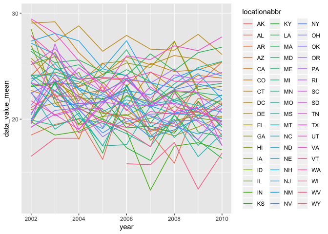
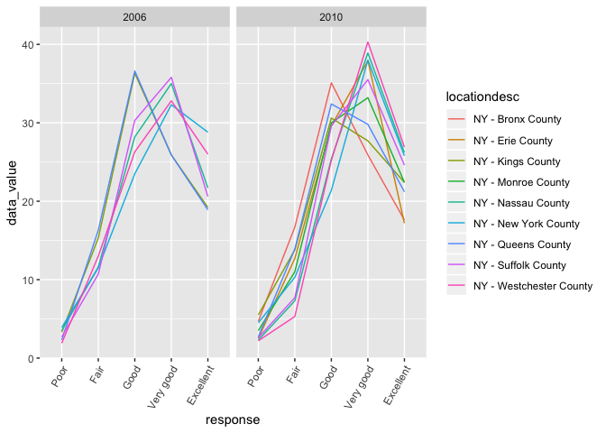
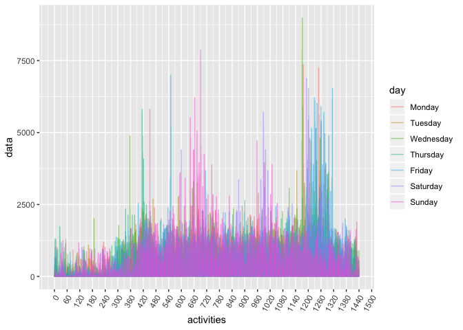

p8105\_hw3\_jl5549
================

Problem 1

``` r
data("instacart")
```

The data contains 1384617 rows and 15 variables.  
Some key variables are shown following: order\_dow: the day of the week
on which the order was placed, order\_hour\_of\_day: the hour of the day
on which the order was placed, product\_name: name of the product,
aisle\_id: aisle identifier, aisle: the name of the aisle.

``` r
info_aisle= 
  instacart %>% 
  group_by(aisle) %>%
  summarize(n_items = n()) %>% 
  arrange(n_items)
n_aisle = nrow(info_aisle)
aisle_most_order = info_aisle[nrow(info_aisle),1]
```

There are 134 aisles and the aisle the most items are orderd from is
fresh vegetables.

``` r
#a plot showing the number of items ordered in each aisle
instacart %>% 
  group_by(aisle) %>% 
  summarize(n_items = n()) %>% 
  filter(n_items>10000) %>% 
  ggplot()+
  geom_col(aes(x = aisle, y = n_items))+
  theme(axis.text.x = element_text(angle = 60, hjust = 1)) +
  labs(x = 'Aisle',
       y = 'Number of items ordered',
       title = 'The number of items ordered in each aisle')
```

<!-- --> It
can be concluded that users order their products the most in aisles
‘fresh friut’ and ‘fresh vegetables’, and relatively less products in
aisles ‘oils vinegars’ and ‘butter’.

``` r
#a table showing the three most popular items in three aisles
instacart %>%
  filter(aisle %in% c('baking ingredients', 'dog food care', 'packaged vegetables fruits')) %>%
   group_by(aisle,product_name) %>%  
  summarize(n = n()) %>% 
  filter(min_rank(desc(n)) < 4) 
```

    ## # A tibble: 9 x 3
    ## # Groups:   aisle [3]
    ##   aisle                     product_name                                  n
    ##   <chr>                     <chr>                                     <int>
    ## 1 baking ingredients        Cane Sugar                                  336
    ## 2 baking ingredients        Light Brown Sugar                           499
    ## 3 baking ingredients        Pure Baking Soda                            387
    ## 4 dog food care             Organix Chicken & Brown Rice Recipe          28
    ## 5 dog food care             Small Dog Biscuits                           26
    ## 6 dog food care             Snack Sticks Chicken & Rice Recipe Dog T…    30
    ## 7 packaged vegetables frui… Organic Baby Spinach                       9784
    ## 8 packaged vegetables frui… Organic Blueberries                        4966
    ## 9 packaged vegetables frui… Organic Raspberries                        5546

Products ordered the most in each of the aisles “baking ingredients”,
“dog food care”, and “packaged vegetables fruits” are Light Brown
Sugar(499), Snack Sticks Chicken & Rice Recipe Dog Treats(30) and
Organic Baby Spinach(9784) respectively. The number of products ordered
in aisle ‘packaged vegetables fruits’ are generally more than other two
aisles.

``` r
#a table showing the mean hour of the day
instacart %>%
  group_by(product_name, order_dow) %>% 
  summarize(mean_hour = mean(order_hour_of_day)) %>% 
  filter( product_name %in% c('Pink Lady Apples', 'Coffee Ice Cream')) %>%
  pivot_wider(names_from = product_name,
              values_from = mean_hour) %>% 
  select(-order_dow)
```

    ## # A tibble: 7 x 2
    ##   `Coffee Ice Cream` `Pink Lady Apples`
    ##                <dbl>              <dbl>
    ## 1               13.8               13.4
    ## 2               14.3               11.4
    ## 3               15.4               11.7
    ## 4               15.3               14.2
    ## 5               15.2               11.6
    ## 6               12.3               12.8
    ## 7               13.8               11.9

Users normally order more coffe ice cream from Wednesday to Friday, and
order the most Pink Lady Apples on Thursday.

Problem2

``` r
data("brfss_smart2010")
mydata =brfss_smart2010 %>% 
    janitor::clean_names() %>% 
    filter(topic == "Overall Health",
           response %in% c("Poor", "Fair", "Good", "Very good", "Excellent")) %>%
   mutate(response = factor(response,levels = c("Poor", "Fair", "Good", "Very good", "Excellent"))) 
head(mydata)
```

    ## # A tibble: 6 x 23
    ##    year locationabbr locationdesc class topic question response sample_size
    ##   <int> <chr>        <chr>        <chr> <chr> <chr>    <fct>          <int>
    ## 1  2010 AL           AL - Jeffer… Heal… Over… How is … Excelle…          94
    ## 2  2010 AL           AL - Jeffer… Heal… Over… How is … Very go…         148
    ## 3  2010 AL           AL - Jeffer… Heal… Over… How is … Good             208
    ## 4  2010 AL           AL - Jeffer… Heal… Over… How is … Fair             107
    ## 5  2010 AL           AL - Jeffer… Heal… Over… How is … Poor              45
    ## 6  2010 AL           AL - Mobile… Heal… Over… How is … Excelle…          91
    ## # … with 15 more variables: data_value <dbl>, confidence_limit_low <dbl>,
    ## #   confidence_limit_high <dbl>, display_order <int>,
    ## #   data_value_unit <chr>, data_value_type <chr>,
    ## #   data_value_footnote_symbol <chr>, data_value_footnote <chr>,
    ## #   data_source <chr>, class_id <chr>, topic_id <chr>, location_id <chr>,
    ## #   question_id <chr>, respid <chr>, geo_location <chr>

``` r
#states observed at 7 or more locations in 2002 and 2010 

mydata %>% 
  group_by(locationdesc, locationabbr, year) %>% 
  summarize(n=n()) %>%  
  filter(year %in% c(2002, 2010)) %>% 
  group_by(year, locationabbr) %>% 
  summarize(n = n()) %>% 
  filter(n > 6)
```

    ## # A tibble: 20 x 3
    ## # Groups:   year [2]
    ##     year locationabbr     n
    ##    <int> <chr>        <int>
    ##  1  2002 CT               7
    ##  2  2002 FL               7
    ##  3  2002 MA               8
    ##  4  2002 NC               7
    ##  5  2002 NJ               8
    ##  6  2002 PA              10
    ##  7  2010 CA              12
    ##  8  2010 CO               7
    ##  9  2010 FL              41
    ## 10  2010 MA               9
    ## 11  2010 MD              12
    ## 12  2010 NC              12
    ## 13  2010 NE              10
    ## 14  2010 NJ              19
    ## 15  2010 NY               9
    ## 16  2010 OH               8
    ## 17  2010 PA               7
    ## 18  2010 SC               7
    ## 19  2010 TX              16
    ## 20  2010 WA              10

In 2002, states CT, FL, MA, NC, NJ, PA were observed at 7 or more
locations. In 2010, they are CA, CO, FL, MA, MD, NC, NE, NJ, NY, OH, PA,
SC, TX, WA.

``` r
#a dataset that is limited to Excellent and a new variable created
excellent = mydata %>% 
  filter(response == 'Excellent') %>% 
  group_by(locationabbr, year) %>% 
  mutate(data_value_mean = mean(data_value))
head(excellent)
```

    ## # A tibble: 6 x 24
    ## # Groups:   locationabbr, year [2]
    ##    year locationabbr locationdesc class topic question response sample_size
    ##   <int> <chr>        <chr>        <chr> <chr> <chr>    <fct>          <int>
    ## 1  2010 AL           AL - Jeffer… Heal… Over… How is … Excelle…          94
    ## 2  2010 AL           AL - Mobile… Heal… Over… How is … Excelle…          91
    ## 3  2010 AL           AL - Tuscal… Heal… Over… How is … Excelle…          58
    ## 4  2010 AZ           AZ - Marico… Heal… Over… How is … Excelle…         269
    ## 5  2010 AZ           AZ - Pinal … Heal… Over… How is … Excelle…          68
    ## 6  2010 AZ           AZ - Pima C… Heal… Over… How is … Excelle…         133
    ## # … with 16 more variables: data_value <dbl>, confidence_limit_low <dbl>,
    ## #   confidence_limit_high <dbl>, display_order <int>,
    ## #   data_value_unit <chr>, data_value_type <chr>,
    ## #   data_value_footnote_symbol <chr>, data_value_footnote <chr>,
    ## #   data_source <chr>, class_id <chr>, topic_id <chr>, location_id <chr>,
    ## #   question_id <chr>, respid <chr>, geo_location <chr>,
    ## #   data_value_mean <dbl>

A “spaghetti” plot of this average value over time within a state is
shown below:

``` r
excellent %>% 
  ggplot()+
  geom_line(aes(x = year, y = data_value_mean,
                color = locationabbr, group = locationabbr))+
  scale_y_continuous(
    breaks = c(10, 20, 30), 
    limits = c(12, 30))
```

    ## Warning: Removed 65 rows containing missing values (geom_path).

<!-- -->

``` r
#a two-panel plot showing distribution of data_value for responses among locations in NY State for the years 2006 and 2010
mydata %>%
  filter(locationabbr == 'NY',
         year %in% c(2006,2010)) %>% 
  ggplot()+
  geom_line(aes(x = response, y = data_value,
                color = locationdesc, 
                group = locationdesc ))+
  theme(axis.text.x = element_text(angle = 60, hjust = 1))+
  facet_grid(~year)
```

<!-- --> It
can seen that ‘Very good’ is generally the most response in 2006 and
2010 across the counties in NY state. Problem 3

``` r
accel = read_csv(file = './accel_data.csv')
```

    ## Parsed with column specification:
    ## cols(
    ##   .default = col_double(),
    ##   day = col_character()
    ## )

    ## See spec(...) for full column specifications.

``` r
accel_tidy = accel %>%
  janitor::clean_names() %>% 
  mutate(weekday_vs_weekend = ifelse(day %in% c('Saturday', 'Sunday'), '0', '1')) %>% 
  select(weekday_vs_weekend, everything()) %>%  
  pivot_longer(5:ncol(.),
              names_to = 'activities',
              values_to = 'data',
              names_prefix = 'activity_')
head(accel_tidy)
```

    ## # A tibble: 6 x 6
    ##   weekday_vs_weekend  week day_id day    activities  data
    ##   <chr>              <dbl>  <dbl> <chr>  <chr>      <dbl>
    ## 1 1                      1      1 Friday 1           88.4
    ## 2 1                      1      1 Friday 2           82.2
    ## 3 1                      1      1 Friday 3           64.4
    ## 4 1                      1      1 Friday 4           70.0
    ## 5 1                      1      1 Friday 5           75.0
    ## 6 1                      1      1 Friday 6           66.3

There are 6 variables existing, including following key variables:
weekday\_vs\_weekend: indicate whether the day monitored is a weedkay or
a day of weekend. ‘1’ indicates a weekday, otherwise a day in weekend
activities: nth minute of a 24-hour day starting at midnight data:
activity counts for yertain minute There are 50400 observations.

``` r
total = accel_tidy %>% 
  group_by(day_id, week, day) %>% 
  summarize(total = sum(data)) %>% 
  mutate(day = factor(day, levels =c('Monday', 'Tuesday', 
                                              'Wednesday', 'Thursday', 'Friday', 'Saturday', 'Sunday')))
```

According to the table created, the trend of activities for each day are
not apparent.

``` r
activity = 
  accel_tidy %>%
  group_by(week, day_id) %>% 
  mutate(day = factor(day, levels =c('Monday', 'Tuesday', 'Wednesday',
                                     'Thursday', 'Friday', 'Saturday', 'Sunday')),
         activities = as.integer(activities)) %>% 
  arrange(activities)
  
activity %>% 
  ggplot(aes(x = activities, y = data, color = day))+
  geom_line(alpha = 0.5)+
  theme(axis.text.x = element_text(angle = 60, hjust = 1))+
  scale_x_continuous(breaks  = seq(0, 1500, 60))
```

<!-- -->

``` r
activity  
```

    ## # A tibble: 50,400 x 6
    ## # Groups:   week, day_id [35]
    ##    weekday_vs_weekend  week day_id day       activities  data
    ##    <chr>              <dbl>  <dbl> <fct>          <int> <dbl>
    ##  1 1                      1      1 Friday             1  88.4
    ##  2 1                      1      2 Monday             1   1  
    ##  3 0                      1      3 Saturday           1   1  
    ##  4 0                      1      4 Sunday             1   1  
    ##  5 1                      1      5 Thursday           1  47.4
    ##  6 1                      1      6 Tuesday            1  64.8
    ##  7 1                      1      7 Wednesday          1  71.1
    ##  8 1                      2      8 Friday             1 675  
    ##  9 1                      2      9 Monday             1 291  
    ## 10 0                      2     10 Saturday           1  64  
    ## # … with 50,390 more rows

We can see from the graph that there are peaks at noon on Sunday and at
night on Monday, Wednesday, Friday and Saturday.
